 

  

`busra@hacettepe:~$ cat stack.toml`

  

`busra@hacettepe:~$ git log --graph --all`

  

`busra@hacettepe:~$ contact --list`

heatmap her gun GitHub Actions ile yenilenir · SVG'ler <code>scripts/</code> altindaki Python dosyalariyla uretilir

